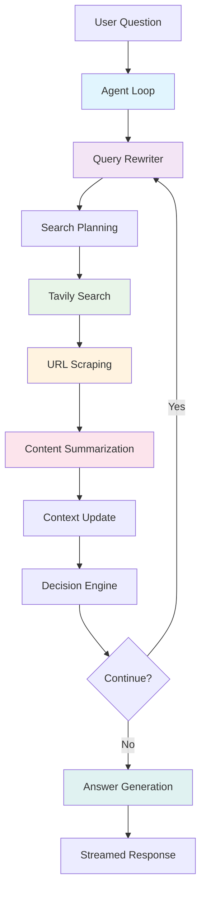

# Deep Search System Design Document

## Overview

The Deep Search system is an AI-powered research assistant that answers user questions by searching the web, scraping content, and synthesizing information from multiple sources. It uses a multi-step agent loop with intelligent caching to provide accurate, well-sourced responses.

## Data Flow Architecture

### High-Level Data Flow



### Detailed Component Flow

```mermaid
graph LR
    subgraph "Input Layer"
        A[Messages: Message[]]
        B[Location: UserLocation]
        C[Telemetry: TelemetrySettings]
    end
    
    subgraph "Agent Loop"
        D[SystemContext]
        E[QueryRewriter]
        F[TavilySearch]
        G[WebScraper]
        H[URLSummarizer]
        I[ActionDecider]
        J[AnswerGenerator]
    end
    
    subgraph "Cache Layer"
        K[Redis Cache]
        L[Search Cache]
        M[Scrape Cache]
        N[Summary Cache]
    end
    
    subgraph "Output Layer"
        O[StreamTextResult]
        P[MessageAnnotations]
    end
    
    A --> D
    B --> D
    C --> D
    D --> E
    E --> F
    F --> L
    F --> G
    G --> M
    G --> H
    H --> N
    H --> I
    I --> J
    J --> O
    I --> P
    
    style K fill:#ffeb3b
    style L fill:#ffeb3b
    style M fill:#ffeb3b
    style N fill:#ffeb3b
```

## Core TypeScript Interfaces

### Input/Output Interfaces

```typescript
// Main entry point options
interface StreamFromDeepSearchOptions {
  messages: Message[];
  onFinish?: (result: { 
    text: string; 
    finishReason: string; 
    usage: LanguageModelUsage; 
    response: unknown 
  }) => Promise<void> | void;
  telemetry: TelemetrySettings;
  writeMessageAnnotation?: (annotation: OurMessageAnnotation) => void;
  location?: UserLocation;
}

// Agent loop configuration
interface RunAgentLoopOptions {
  messages: Message[];
  maxSteps?: number;
  langfuseTraceId?: string;
  writeMessageAnnotation?: (annotation: OurMessageAnnotation) => void;
  onFinish?: (result: { 
    text: string; 
    finishReason: string; 
    usage: LanguageModelUsage; 
    response: unknown 
  }) => Promise<void> | void;
  location?: UserLocation;
}

// User location context
interface UserLocation {
  latitude?: string;
  longitude?: string;
  city?: string;
  country?: string;
}
```

### Query Planning Interfaces

```typescript
// Query plan schema and type
const queryPlanSchema = z.object({
  plan: z.string().describe(
    "A detailed research plan that outlines the logical progression of information needed to answer the question."
  ),
  queries: z.array(z.string())
    .min(1)
    .max(5)
    .describe(
      "A numbered list of 3-5 sequential search queries that progress logically from foundational to specific information."
    ),
});

type QueryPlan = z.infer<typeof queryPlanSchema>;
```

### Search and Scraping Interfaces

```typescript
// Tavily search interfaces
namespace TavilyTool {
  interface SearchInput {
    query: string;
    maxResults?: number;
    searchDepth?: "basic" | "advanced";
    topic?: "general" | "news" | "finance";
    includeAnswer?: boolean;
    includeImages?: boolean;
    includeImageDescriptions?: boolean;
    includeRawContent?: false | "markdown" | "text";
    includeDomains?: string[];
    excludeDomains?: string[];
    timeRange?: "day" | "week" | "month" | "year" | "d" | "w" | "m" | "y";
    days?: number;
    country?: string;
    forceRefresh?: boolean;
  }

  interface SearchResult {
    title: string;
    url: string;
    content: string;
    score: number;
    publishedDate?: string;
    rawContent?: string;
    favicon?: string;
  }

  interface TavilySearchResponse {
    query: string;
    searchParameters: SearchParameters;
    results: SearchResult[];
    responseTime: number;
    answer?: string;
    images?: ImageResult[];
    autoParameters?: {
      topic: string;
      searchDepth: string;
    };
  }
}

// Web scraping interfaces
interface CrawlSuccessResponse {
  success: true;
  data: string;
}

interface CrawlErrorResponse {
  success: false;
  error: string;
}

type CrawlResponse = CrawlSuccessResponse | CrawlErrorResponse;

interface BulkCrawlOptions extends CrawlOptions {
  urls: string[];
}
```

### Context Management Interfaces

```typescript
// Search result and history types
interface SearchResult {
  date?: string;
  title: string;
  url: string;
  snippet: string;
  summary: string;
}

interface SearchHistoryEntry {
  query: string;
  results: SearchResult[];
}

// System context class
class SystemContext {
  private step: number;
  private messages: Message[];
  private searchHistory: SearchHistoryEntry[];
  private userLocation: UserLocation | null;
  
  constructor(messages?: Message[], location?: UserLocation);
  
  // Core methods
  shouldStop(): boolean;
  getCurrentStep(): number;
  incrementStep(): void;
  getUserLocation(): UserLocation | null;
  getUserQuestion(): string;
  getMessageHistory(includeLabels?: boolean): string;
  reportSearch(search: SearchHistoryEntry): void;
  getSearchHistory(): string;
  getSearchHistoryArray(): SearchHistoryEntry[];
}
```

### Action and Decision Interfaces

```typescript
// Action schema for decision making
const actionSchema = z.object({
  title: z.string().describe(
    "The title of the action, to be displayed in the UI. Be extremely concise."
  ),
  reasoning: z.string().describe("The reason you chose this step."),
  type: z.enum(["continue", "answer"]).describe(
    "The type of action to take. 'continue': Continue researching. 'answer': Answer the user's question."
  ),
});

type Action = z.infer<typeof actionSchema>;

// Message annotations for UI feedback
interface OurMessageAnnotation {
  type: "NEW_ACTION";
  action: Action;
}
```

### Summarization Interfaces

```typescript
// URL summarization options
interface SummarizeURLOptions {
  conversationHistory: string;
  scrapedContent: string;
  searchMetadata: {
    date?: string;
    title: string;
    url: string;
    snippet: string;
  };
  query: string;
  langfuseTraceId?: string;
}

// Answer generation options
interface AnswerQuestionOptions {
  isFinal: boolean;
  langfuseTraceId?: string;
  onFinish?: (result: { 
    text: string; 
    finishReason: string; 
    usage: LanguageModelUsage; 
    response: unknown 
  }) => Promise<void> | void;
}
```

## Database Schema

### Current Tables (Drizzle ORM)

```typescript
// User management
export const users = createTable("user", {
  id: varchar("id", { length: 255 }).notNull().primaryKey(),
  name: varchar("name", { length: 255 }),
  email: varchar("email", { length: 255 }).notNull(),
  emailVerified: timestamp("emailVerified", { mode: "date" }),
  image: varchar("image", { length: 255 }),
});

// Authentication
export const accounts = createTable("account", {
  userId: varchar("userId", { length: 255 }).notNull(),
  type: varchar("type", { length: 255 }).notNull(),
  provider: varchar("provider", { length: 255 }).notNull(),
  providerAccountId: varchar("providerAccountId", { length: 255 }).notNull(),
  refresh_token: text("refresh_token"),
  access_token: text("access_token"),
  expires_at: integer("expires_at"),
  token_type: varchar("token_type", { length: 255 }),
  scope: varchar("scope", { length: 255 }),
  id_token: text("id_token"),
  session_state: varchar("session_state", { length: 255 }),
});

// Chat management
export const chats = createTable("chat", {
  id: varchar("id", { length: 255 }).notNull().primaryKey(),
  userId: varchar("userId", { length: 255 }).notNull(),
  title: varchar("title", { length: 255 }).notNull(),
  createdAt: timestamp("createdAt").default(sql`CURRENT_TIMESTAMP`).notNull(),
  updatedAt: timestamp("updatedAt").default(sql`CURRENT_TIMESTAMP`).notNull(),
  archived: boolean("archived").default(false).notNull(),
});

// Message storage
export const messages = createTable("message", {
  id: varchar("id", { length: 255 }).notNull().primaryKey(),
  chatId: varchar("chatId", { length: 255 }).notNull(),
  role: varchar("role", { length: 255 }).notNull(),
  content: text("content").notNull(),
  annotations: json("annotations"),
  createdAt: timestamp("createdAt").default(sql`CURRENT_TIMESTAMP`).notNull(),
});

// Usage tracking
export const userRequests = createTable("user_request", {
  id: serial("id").primaryKey(),
  userId: varchar("userId", { length: 255 }),
  sessionId: varchar("sessionId", { length: 255 }),
  requestType: varchar("requestType", { length: 50 }).notNull(),
  tokensUsed: integer("tokensUsed").default(0),
  createdAt: timestamp("createdAt").default(sql`CURRENT_TIMESTAMP`).notNull(),
});
```

## Caching Architecture

### Current Cache Implementation

```typescript
// Redis cache wrapper with dynamic configuration
interface CacheOptions<TFunc extends (...args: any[]) => Promise<any>> {
  getDuration?: (...args: Parameters<TFunc>) => number;
  shouldSkipCache?: (...args: Parameters<TFunc>) => boolean;
}

function cacheWithRedis<TFunc extends (...args: any[]) => Promise<any>>(
  keyPrefix: string,
  fn: TFunc,
  options?: CacheOptions<TFunc>
): TFunc;
```

### Cache Layers

1. **Tavily Search Cache**
   - Key: `tavily:${JSON.stringify(searchInput)}`
   - Duration: 30min-6hrs (dynamic based on query type)
   - Skip: `forceRefresh` parameter

2. **Web Scraping Cache**
   - Key: `crawlWebsite:${JSON.stringify({url, maxRetries})}`
   - Duration: 6 hours (default)
   - Content limit: 30KB

3. **URL Summarization Cache**
   - Key: `summarizeURL:${JSON.stringify(options)}`
   - Duration: 12 hours
   - Includes conversation history in key

4. **Bulk Scraping Cache**
   - Key: `scrapePages:${JSON.stringify({urls, maxRetries})}`
   - Duration: 6 hours (default)

## API Endpoints

### Current Endpoints

```typescript
// Main chat endpoint
POST /api/chat
- Body: { messages: Message[] }
- Returns: StreamTextResult<Record<string, never>, string>
- Uses: runAgentLoop with deep search

// Debug endpoint
GET /api/debug
- Returns: System debugging information

// Authentication endpoints
GET/POST /api/auth/[...nextauth]
- Handles: NextAuth.js authentication flow
```

## Performance Characteristics

### Current Bottlenecks

1. **No Final Answer Caching**: Same research = regenerated answers
2. **No Query Plan Caching**: Same questions = regenerated query plans
3. **Conversation History in Cache Keys**: Reduces cache hit rates
4. **Sequential Processing**: No parallel execution optimizations

### Scalability Considerations

1. **Redis Memory Usage**: JSON serialization of large objects
2. **API Rate Limits**: Tavily and scraping rate limits
3. **Content Size Limits**: 30KB limit on scraped content
4. **Step Limits**: Maximum 10 steps per research loop

## Security Considerations

1. **robots.txt Compliance**: Checks before scraping
2. **Content Sanitization**: HTML cleaning and markdown conversion
3. **Rate Limiting**: Built into external API calls
4. **User Authentication**: NextAuth.js integration
5. **Input Validation**: Zod schema validation

## Dependencies

### Core Dependencies
- **AI SDK**: Vercel AI SDK for LLM interactions
- **Tavily**: Web search API
- **Redis**: Caching layer
- **Drizzle**: Database ORM
- **NextAuth**: Authentication
- **Cheerio**: HTML parsing
- **Turndown**: HTML to Markdown conversion

### Infrastructure
- **Database**: PostgreSQL
- **Cache**: Redis
- **Authentication**: OAuth providers
- **Monitoring**: LangFuse telemetry

## Current Limitations

1. **Cache Efficiency**: Low hit rates due to conversation history inclusion
2. **Answer Consistency**: No deterministic output for identical inputs
3. **Resource Utilization**: Redundant AI calls for similar queries
4. **Monitoring**: Limited cache performance metrics
5. **Cache Invalidation**: No sophisticated invalidation strategies
